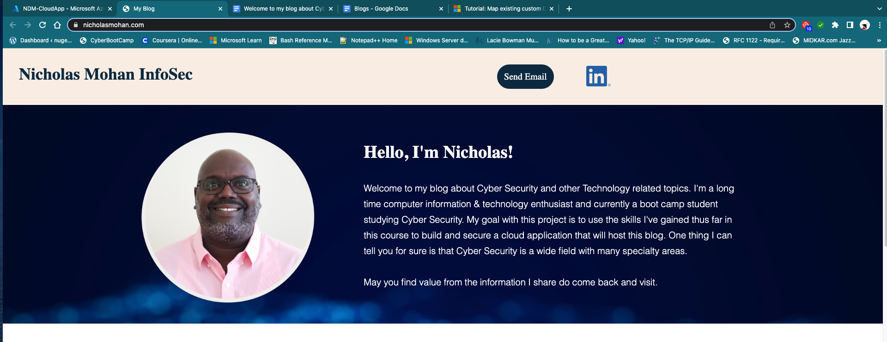
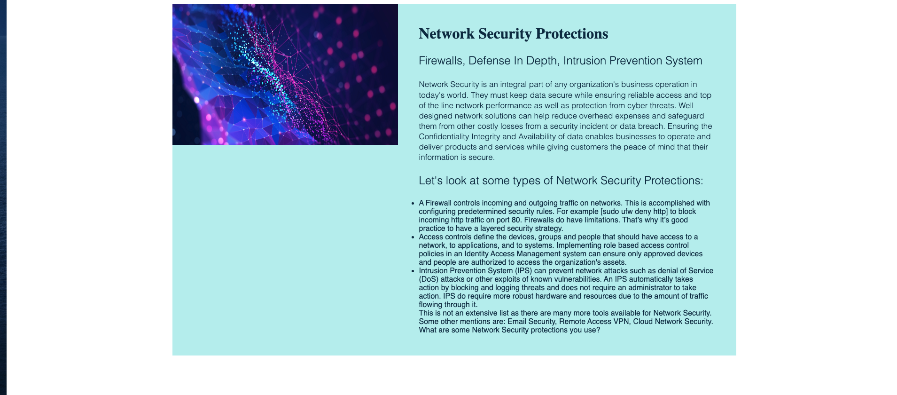
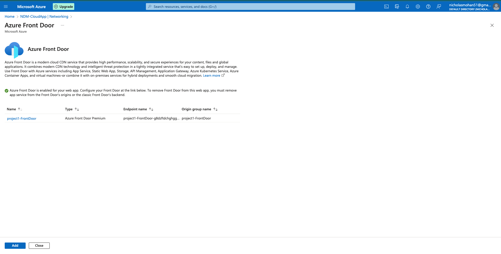
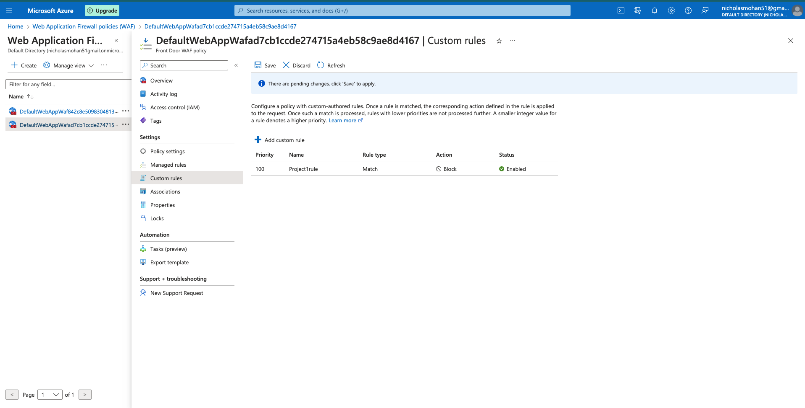

<h1>Securing-Cloud-Applications</h1>

<h2>Description</h2>
For my first project I combined many of the topics learn't in previous classes 
to create and deploy my own "cyber-blog" web application using Microsoft Azure. 
Secured it with a SSL certificate, and applied some of Azure's security features to protect the app. 
<br/>


<h2>Technologies Used</h2>

- <b>Azure: {Keyvaults, App Services, Front Door, WAF} PHP, HTML, Docker, OpenSSL
</b> 

<h2>Environments Used </h2>

- <b>Developed and designed a cyber-blog web application using Azure’s Cloud services and Docker.</b> 
- <b>Created and stored SSL certificates in Azure’s Key Vault, and bound them to secure the web application.</b> 
- <b>Protected the web application by utilizing Azure’s Security features, such as Azure’s Front Door, WAF, and Security Center.</b>

<h2>Technical Brief</h2>

<p align="center">
My Web Application:<br/>
 <p>For a domain we had two options (Azure free domain or a godaddy domain).
  Since I had a domain registered with godaddy alread it was a easy choice for me.</p>
  
 
Domain Name:  <br/>

<br />
<br />
Blogs: <br/>

<br />
<br />

<p>
<h2>Networking Questions<h2/>


1. What is the IP address of your webpage?


[20.211.64.15]
	

2. What is the location (city, state, country) of your IP address?


[ Sydney, New South Wales, Australia]
	

3. Run a DNS lookup on your website. What does the NS record show?


[Non-authoritative answer:
nicholasmohan.com        nameserver = ns51.domaincontrol.com.
nicholasmohan.com        nameserver = ns52.domaincontrol.com.
<br/>

<h2>Web Development Questions<h2/>


1. When creating your web app, you selected a runtime stack.  What was it? Does it work on the front end or the back end? 


[For my web app I selected PHP 8.1 and it works on the back end]
	

2. Inside the /var/www/html directory, there was another directory called assets. Explain what was inside that directory.


[Inside the asset directory there is a CSS directory with a style.css file. CSS allows you to control the design of web pages. The images directory contains images files used by the web site. ]
	

3. Consider your response to the above question. Does this work with the front end or back end?


[Front End]
	


Day 2 Questions


Cloud Questions


1. What is a cloud tenant?


[A tenant is the organization that owns and manage a specific instance of microsoft cloud services]
	

2. Why would an access policy be important on a key vault?


[Having an access policy on a key vault is essential because it determines WHO (security principal, user or user group) can perform different operations within organizations or apps]
	

3. Within the key vault, what are the differences between keys, secrets, and certificates?


Referenced From: Azure Key Vaults


Key Vault Keys:
* Within the key vault there are two types of resources that store and manage cryptographic keys.
   1. Vaults - Vaults provide a low-cost, easy to deploy, multi-tenant, zone-resilient (where available), highly available key management solution suitable for most common cloud application scenarios.
   2. Managed HSMs - Managed HSM provides single-tenant, zone-resilient (where available), highly available HSMs to store and manage your cryptographic keys. Most suitable for applications and usage scenarios that handle high value keys. Also helps to meet most stringent security, compliance, and regulatory requirements.
      Key Vault Secrets:
* Provides secure storage of generic secrets, such as passwords and database connection strings.
* The following permissions can be used, on a per-principal basis, in the secrets access control entry on a vault, and closely mirror the operations allowed on a secret object.
Key Vault Certificates:


* Allows a certificate owner to create a certificate through a key vault creation process or through the import of an existing certificate. This includes both self-signed certificates and certificates that are generated from a certificate authority (CA).
* * Allows a Key Vault certificate owner to implement secure storage and management of X.509 certificates without interacting with private key material.
* * Allows a certificate owner to create a policy that directs Key Vault to manage the lifecycle of a certificate.
* * Allows a certificate owner to provide contact information for notifications about the lifecycle events of expiration and renewal.
* * Supports automatic renewal with selected issuers: Key Vault partner X.509 certificate providers and CAs.


	

Cryptography Questions


1. What are the advantages of a self-signed certificate?


* They are Free
* Useful in test environments
* No reliance on others for certificate issuance
	

2. What are the disadvantages of a self-signed certificate?


* They can pose a serious risk if compromised
* They are not vetted by a trusted source
* They cannot be revoked by a certificate authority
	

3. What is a wildcard certificate?


Wildcard certificate is a single certificate with a wildcard character (*) in the domain name field. This allows the certificate to secure multiple sub domain names (hosts) pertaining to the same base domain.
	

4. When binding a certificate to your website, Azure only provides TLS versions 1.0, 1.1, and 1.2.  Explain why SSL 3.0 isn’t provided.


According to web research SSL 3.0 had a critical vulnerability that allowed attackers to calculate the plaintext of encrypted connections.Link to article here
	

5. After completing the Day 2 activities, view your SSL certificate and answer the following questions:


   1. Is your browser returning an error for your SSL certificate? Why or why not?


No. My browser did not return an error because the SSL certificate was issued from a trusted certificate authority. 
	

   2. What is the validity of your certificate (date range)?


  

	

   3. Do you have an intermediate certificate? If so, what is it?


 Yes.   
	

   4. Do you have a root certificate? If so, what is it?


Yes.   
	

   5. Does your browser have the root certificate in its root store?


Yes
	

   6. List one other root CA in your browser’s root store.


ComSign Global Root CA
	


Day 3 Questions


Cloud Security Questions 


1. What are the similarities and differences between Azure Web Application Gateway and Azure Front Door?


Some similarities between Web Application Gateway and Front Door are
* They can incorporate a web application firewall (WAF) to protect against web vulnerability attacks.
* They have additional features such as URL path-based routing and SSL/TLS termination.
 And Some Differences
* Azure Front Door is global which makes it  better suited for when you have a variety of regions in  a cloud environment. 
* Web app gateway is more regional.
* Protects web apps in a single region
	

2. A feature of the Web Application Gateway and Front Door is “SSL Offloading.” What is SSL offloading? What are its benefits?


[SSL offloading is used for removing the SSL encryption from incoming traffic to reduce the processing burden of a web server: encrypting/decrypting traffic, which is sent through SSL. It doesn’t mean that it removes the installed SSL/TLS certificate, but it uses another separate device that is designed for the purpose of SSL termination or accelerating SSL. There are two types of SSL offloading
1. SSL Termination
2. SSL Bridging]
Some benefits are
* The server doesn’t require encrypting and decrypting all the data coming from the client-side, which helps in reducing the workload and increasing the loading speed.
* Some of the websites where SSL termination can be considered are blogs, information related websites like Wikipedia, YouTube. One of those who don’t deal with any sensitive data of the use
* Compared to SSL Termination, SSL Bridging is safer as the data remains encrypted throughout the transmission process, which means from the client to the load balancer and from the load balancer to the server, it stays encrypted.
	

3. What OSI layer does a WAF work on?


[Azure Web Application Firewall work on the OSI Application Layer 7]
	

4. Select one of the WAF managed rules (e.g., directory traversal, SQL injection, etc.), and define it.


SQL injection attack: is the insertion or “injection” of a SQL query via the input data from the client to the application. A successful SQL injection exploit can read sensitive data from the database, modify database data (Insert/Update/Delete), execute administration operations on the database (such as shutdown the DBMS), recover the content of a given file present on the DBMS file system and in some cases issue commands to the operating system. SQL injection attacks are a type of injection attack, in which SQL commands are injected into data-plane input in order to affect the execution of predefined SQL commands.
	

5. Consider the rule that you selected. Could your website (as it is currently designed) be impacted by this vulnerability if Front Door wasn’t enabled? Why or why not?


[Based on how my site is currently configured It does not have any databases so I would say no this vulnerability would not have any impact is Font Door wasn’t enabled]
	

6. Hypothetically, say that you create a custom WAF rule to block all traffic from Canada. Does that mean that anyone who resides in Canada would not be able to access your website? Why or why not? 


[I think it means that any source IP from Canada will be blocked. So for example if I was using a VPN like keepsolid I would be able to use a virtual IP from an approved location and still access the site even if I’m in Canada]
	

7. Include screenshots below to demonstrate that your web app has the following:


   1. Azure Front Door enabled: <br/>

<br />

   2. A WAF custom rule

<br />

 </p>


<!--
 ```diff
- text in red
+ text in green
! text in orange
# text in gray
@@ text in purple (and bold)@@
```
--!>
